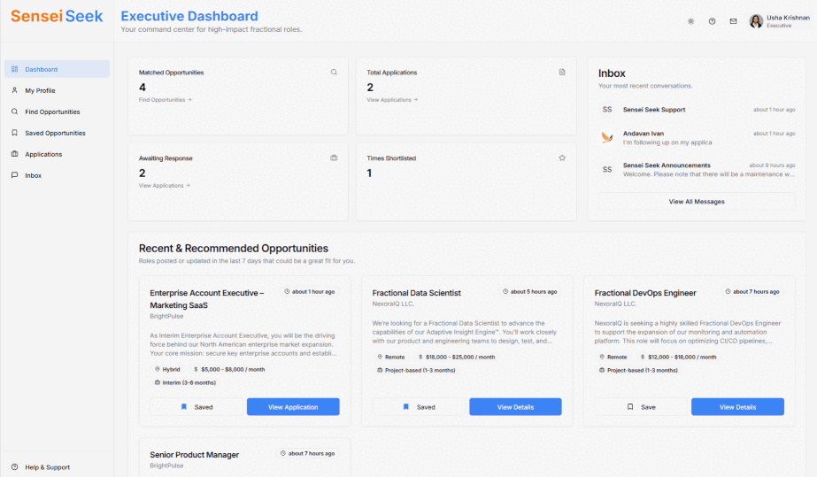
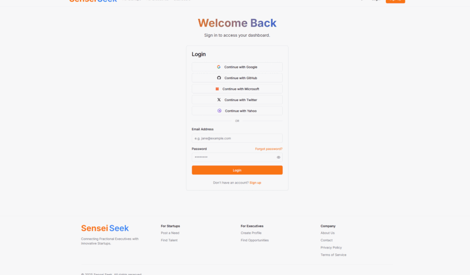

# Sensei Seek: Fractional Executive Marketplace

     

Sensei Seek is now an open-source educational project aimed at helping developers, researchers, and product teams learn about building an AI-assisted marketplace. This repository contains the application code, documentation, and scripts needed to run, evaluate, and extend the matching pipeline, embedding backfill, and admin tooling.

We welcome contributions, bug reports, and constructive feedback. Read the short contribution notes below and follow the Code of Conduct when participating in the project.

---

## Visual walkthrough & persona highlights

Below are short animated walkthroughs (GIFs) that illustrate three core perspectives of the product. These visuals focus on expected user experience and product intent.

<!-- Thumbnails: click to open the full GIF -->

    
    
    

- Market & solution overview — 
  - Focus: high-level marketplace dynamics (how matches flow from vector retrieval, optional rerank, and durable cache into the gallery). Expect: emphasis on responsiveness and how background recompute keeps results fresh.

- Executive workflow — 
  - Focus: quick discovery → review → apply/shortlist. Expect: minimal clicks, clear fit signal, and an emphasis on low-effort actions for executives who evaluate many opportunities.

- Startup experience — 
  - Focus: creating a need, viewing matched executives, and starting outreach. Expect: a compact flow where startups can identify and contact candidates quickly; AI help is conservative and opt-in.

## Features

- Dual-Sided Marketplace: Separate, tailored experiences for both Startups and Executives.
- AI-Powered Matching: Intelligently matches executives to startup needs based on skills, experience, and company fit.
- AI-Assisted Content Generation: Leverages generative AI to help users craft compelling profiles, job descriptions, and initial outreach messages.
- Comprehensive Profiles: Startups can showcase their mission and funding, while executives can detail their expertise and accomplishments.

## Tech stack

- Next.js (App Router) + React + TypeScript
- Firebase (Auth, Firestore) for backend services and session management
- Pinecone for vector storage and ANN retrieval (adapter in `src/lib/vector-db.ts`)
- Embedding provider: configurable via `EMBEDDING_API_URL` / `EMBEDDING_API_KEY` with a deterministic fallback
- LLM flows (GenKit / configurable provider) for reranking and rationale generation
- Vitest for tests
- Tailwind CSS + component UI primitives for the frontend
- Scripts for backfilling embeddings and querying Pinecone (`scripts/backfill-embeddings.js`, `scripts/pinecone-query.js`)

### Where to tune (quick links)

If you want to adjust matching behavior or resource/cost trade-offs, these are the main knobs and where to find them:

- Embedding model & dimension
  - Env vars: `EMBEDDING_API_URL`, `EMBEDDING_API_KEY`, `EMBEDDING_MODEL`, `PINECONE_INDEX_DIM`
  - Code: `src/lib/embeddings.ts`

- Vector DB / Pinecone
  - Env vars: `PINECONE_API_KEY`, `PINECONE_ENV`, `PINECONE_INDEX_NAME`, or `PINECONE_BASE_URL`
  - Code: `src/lib/vector-db.ts`

- Retrieval vs rerank trade-off
  - Env vars: `USE_VECTOR_DB`, `MATCH_RERANK_TOP_K`
  - Code: `src/lib/actions.ts` (search for `MATCH_RERANK_TOP_K` and rerank logic)

Quick operational note: If you encounter LLM rate limits (429), set these env vars for immediate relief:

- `MATCH_RERANK_TOP_K=0` — disables LLM rerank and uses vector-only scores (recommended for dev or small free-tier quotas).
- `MATCH_CONCURRENCY=1` — minimizes concurrent LLM calls; useful when backends or workers otherwise create bursts.

These two settings together will dramatically reduce LLM calls and avoid many quota errors while you evaluate or upgrade your provider plan.

Circuit-breaker & retry knobs: The code now includes a Firestore-backed circuit-breaker that sets a shared cooldown when a 429/quota error is detected so all instances back off. Use the following env vars to tune retry/backoff behavior:

- `MATCH_AI_MAX_ATTEMPTS` — maximum attempts per AI call (default 3). Lower to avoid multiplied retries.
- `MATCH_AI_BASE_DELAY_MS` — base backoff in ms (default 500). Exponential backoff + jitter is applied.

These knobs + the shared cooldown help the system respect provider rate limits and avoid noisy retries from multiple processes.

- Backfill and batching
  - Env vars: `EMBED_BACKFILL_BATCH`
  - Scripts: `scripts/backfill-embeddings.js`

- Matching cache behavior & invalidation
  - Code: `src/lib/matching-cache.ts`

Tuning tips:

- Start with `MATCH_RERANK_TOP_K=0` (vector-only) during development to avoid LLM costs.
- Use small backfill batches locally (`EMBED_BACKFILL_BATCH=50`) to avoid provider rate limits.
- Confirm your embedding dimension and Pinecone index dimension match (`PINECONE_INDEX_DIM`) before upserting vectors.

## Core: Matching (highlight)

Matching is central to Sensei Seek. We implemented a production-minded, cost-aware pipeline that combines vector recall, limited AI reranking, and persistent caching to deliver high-quality matches without unbounded AI costs.

Highlights:

- Vector-first candidate retrieval using embeddings (Pinecone adapter in `src/lib/vector-db.ts`).
- Rerank only the top-K candidates with an LLM to produce a final score and rationale (configurable to control cost).
- Firestore matching cache with tags for targeted invalidation to avoid repeated LLM calls on page-load.
- Background recompute worker + admin backfill endpoints to generate missing results asynchronously and avoid 429s during user requests.
- Feature flags (`USE_VECTOR_DB`, `USE_MATCHING_CACHE`, rerank knobs) and graceful fallbacks ensure safe rollout and resilience on AI failures.
- Telemetry-ready (cache hit rates, LLM call counts, latencies) so ops can monitor cost and quality.
 
How matching surfaces relate to UI:

- Find Talent (Startup-facing gallery): shows each executive's single best match score across all the startup's active needs. This score is computed as the highest vector-derived or AI-derived match across those needs (vector-derived when `USE_VECTOR_DB=true` and AI disabled, vector+rerank when rerank is enabled).
- Applicants (per-role listing): shows applicants for a specific role and uses a per-application match score computed for that role specifically (AI flow by default). Applicants therefore reflect role-specific fit while Find Talent reflects overall fit across active roles.

See `docs/MATCHING_IMPLEMENTATION.md` for full design details, operational notes, and the implementation checklist.

### How matching works — explained for an undergraduate student
How to understand matching (simple & practical)

Matching in Sensei Seek is intentionally simple: first we use a fast vector search to find plausible candidates, then we optionally use a small AI reranker to refine the top few. That keeps things fast and cheap while still getting good results.

In plain terms:

- Step 1 — fast recall: we turn startup needs and executive profiles into numeric embeddings and store them in a vector index (Pinecone by default). When a startup asks for candidates, we query the vector index for the nearest executive vectors — this is extremely fast and narrows the candidate set from thousands to a few dozen.
- Step 2 — bounded refinement: we take only the top-K results from the vector search (configurable) and, if enabled, run a single lightweight LLM rerank over that small set to produce final match scores and an optional short rationale. Because the LLM is only used on a tiny subset, token / cost exposure is limited.

Why this design?
- Vector search is cheap and scales well for recall. LLMs are powerful for judgment and nuance but are slow/expensive if used on every candidate. The two-step design balances those trade-offs.

Developer tips:
- If you want a quick, free dev experience: set `MATCH_RERANK_TOP_K=0` to avoid LLM calls and run `scripts/backfill-embeddings.js` to populate vectors locally.
- The system persists a durable, per-startup vector-score map to Firestore at `matching-vector-scores/<startupId>` so the startup-facing gallery (Find Talent) can show vector-derived scores even when rerank is disabled. The background worker refreshes these durable maps and marks them with a small TTL + a `dirty` flag to coordinate updates across instances.

### How matching works — explained for a grad / PhD in machine learning

Architecture and dataflow (concise):

- Representation: Textual fields from `startup-needs` and `executive-profiles` are mapped to dense embeddings using a configurable embedding model (ENV: `EMBEDDING_API_URL`/`EMBEDDING_MODEL`). Embedding vectors are persisted in Firestore `embeddings/*` docs and upserted into Pinecone for nearest-neighbor search.

- Retrieval: For a given startup need, we issue a vector similarity query (ANN) to Pinecone to retrieve the top-N candidate executive vectors. Default index metric is cosine similarity (controlled via Pinecone index configuration). We perform a minimal pre-filter step (metadata filters and optional heuristics) to avoid retrieving obviously irrelevant candidates and reduce the query surface.

- Reranking: The top-K subset is reranked by an LLM-based scoring function. The reranker maps candidate + query into a numeric score and a short textual rationale. Design choices:
  - We restrict the reranker to a small K (configurable) to bound token costs and latency.
  - The reranker uses a deterministic prompt template and returns a structured JSON-like response (score, reasoning). We apply conservative parsing and fallback behavior in case of parse or API errors.

- Caching & consistency: Reranked results (scores + rationales) are written into a Firestore-based matching cache keyed by `startupId` (and optionally `needId`) with tag metadata for targeted invalidation. A recomputeClaim pattern ensures at-most-once worker claims when regenerating cache entries.

- Operational considerations & failure modes:
  - Embedding model dimension must match Pinecone index dimension (env: `PINECONE_INDEX_DIM`). Dimension mismatch is a hard failure at upsert/query time.
  - LLM failures (rate limits, 429s) are mitigated by: (a) caching, (b) feature-flagged rerank that can be disabled, (c) async background workers for backfills and recompute, and (d) graceful fallbacks (vector-only result with score=0 or heuristic scores).
  - Cold-start: Newly created startup needs may have no cached entry; the admin backfill endpoints and the worker are used to precompute results.

- Metrics & evaluation:
  - We instrument cache hit/miss rates, LLM call counts, and re-rank latencies. Typical evaluation criteria: precision@K and qualitative human review of LLM rationales.

- Extensibility notes:
  - The reranker can be replaced by a learned pairwise model (e.g., a lightweight cross-encoder fine-tuned on labeled pairs) if you need lower-cost repeat inference at scale.
  - The pipeline supports alternate vector stores (the code uses an adapter pattern) and multiple embedding providers.

## Quick update: durable precompute & worker persistence

We now persist a per-startup execVectorScores map to Firestore in `matching-vector-scores/<startupId>` with a TTL and a `dirty` flag. The recompute worker writes these docs after vector queries and after LLM reranks so that multi-instance deployments can share precomputed vector-derived scores. Make sure to wire invalidation (`markStartupVectorScoresDirty`) from startup need and executive profile update flows to avoid stale results.

---

## Full visuals

The full-size walkthroughs are shown here for reference. They are intentionally placed at the end so the main README stays compact; click the thumbnails above to jump here or open the GIF directly.

### Executive workflow

### Market & solution overview

### Startup experience

